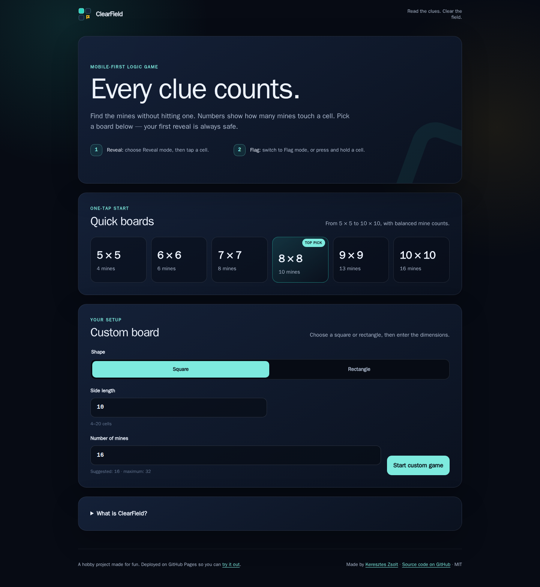
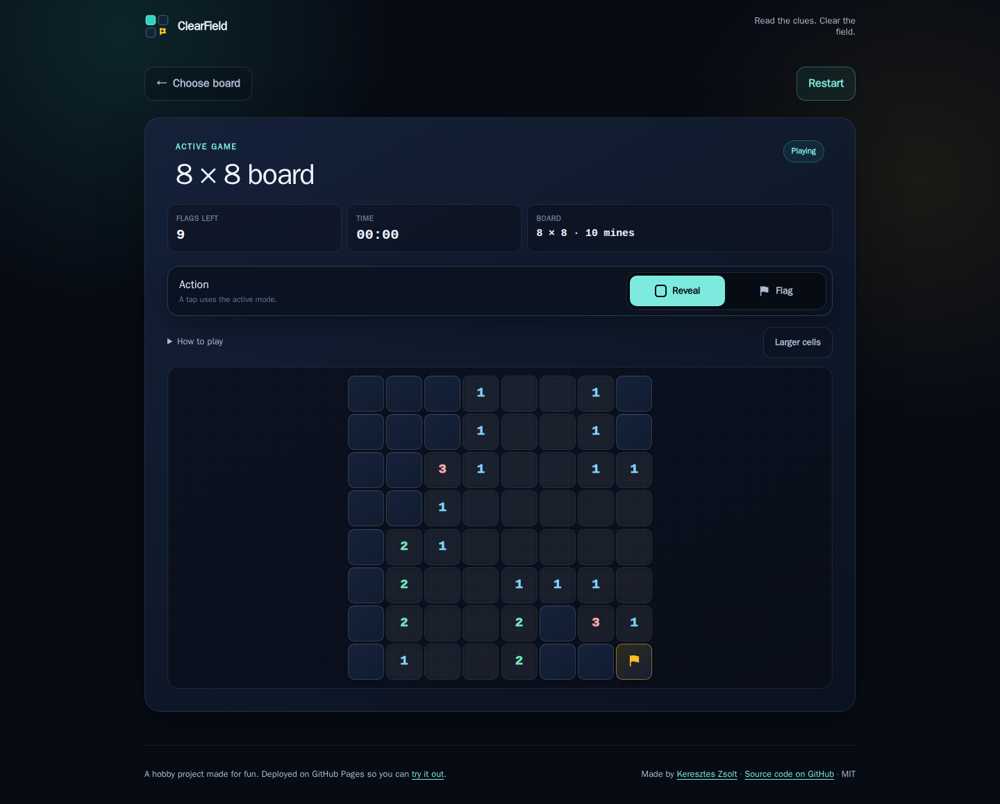
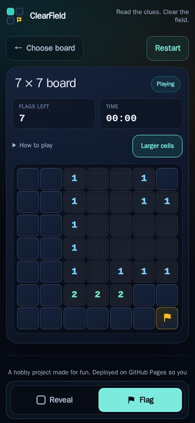

# ClearField

**Read the clues. Clear the field.**

ClearField is a mobile-first, independent, fan-made Minesweeper implementation. It is built with plain HTML, Vanilla JavaScript, and Vanilla CSS—there is no build step, external dependency, analytics package, AI library, account system, or persistent score storage.

[**Play ClearField**](https://kereszteszsolt.net/clear-field/)

This is a hobby project made for fun, deployed on GitHub Pages so anyone can try it out.

## Screenshots

### Choose a board



### Play on desktop and mobile

<p align="center">
  
  
</p>

## Features

- One-tap starts for 5 × 5, 6 × 6, 7 × 7, 8 × 8, 9 × 9, and 10 × 10 boards.
- Custom square or rectangular boards from 4–20 columns and 4–30 rows.
- A clear **Reveal / Flag** mode selector that stays within reach at the bottom of mobile screens.
- Optional **Larger cells** for easier tapping, with a scrolling hint when a board does not fit.
- Quick flagging with a long press on touchscreens or a right-click on desktop.
- A safe first reveal; whenever the board density allows it, the surrounding cells are safe too.
- A responsive board with horizontal scrolling for larger custom layouts.
- Keyboard navigation and screen-reader-friendly cell labels.
- A timer for the current game, with no persistent result or gameplay storage.
- A cohesive visual style built with reusable CSS design tokens.

## Controls

| Device | Reveal | Flag |
| --- | --- | --- |
| Mobile / touch | Select Reveal mode, then tap | Select Flag mode and tap, or press and hold |
| Mouse | Left-click in Reveal mode | Right-click, or left-click in Flag mode |
| Keyboard | Navigate with arrow keys, press `R`, then Enter/Space | Press `F`, then Enter/Space |
| Restart | Press `N` | — |

## Run locally

ClearField is a static project, so no installation or build command is required. You can open `index.html` directly, although a local web server provides the most reliable browser behavior.

### Python

Run the following command from the folder that contains `index.html`:

```bash
python3 -m http.server 8080
```

On Windows, either of these commands may be available:

```powershell
py -m http.server 8080
```

```powershell
python -m http.server 8080
```

Then open `http://localhost:8080` in your browser. Stop the server with `Ctrl + C`.

## Project structure

```text
clear-field/
├── assets/favicon.svg
├── css/styles.css
├── js/
│   ├── app.js
│   └── game.js
├── index.html
├── manifest.webmanifest
└── LICENSE
```

## GitHub About

**Repository name:** `clear-field`

**Description:**

> A mobile-first, fan-made take on the classic Minesweeper puzzle, built with dependency-free Vanilla JavaScript and CSS.

**Topics:**

`vanilla-javascript`, `vanilla-css`, `html5`, `minesweeper`, `puzzle-game`, `mobile-first`, `responsive-design`, `accessible`, `browser-game`, `open-source`

## About the project

ClearField is an independent, fan-made interpretation of classic Minesweeper gameplay, created as a standalone open-source project. It is not affiliated with, endorsed by, or partnered with any original game publisher.

## License

MIT. See [`LICENSE`](LICENSE) for details.

## Contact

**Project maintainer: Keresztes Zsolt**

| Platform | Link |
| --- | --- |
| Website | [kereszteszsolt.hu](https://kereszteszsolt.hu/) |
| GitHub | [@kereszteszsolt](https://github.com/kereszteszsolt) |

> The website is available in multiple languages: Hungarian (HU), English (EN), Romanian (RO), and German (DE).

## ☕ Ways to support

**Explore ways to support the maintainer and their projects.**

[https://kereszteszsolt.hu/en/ways-to-support/](https://kereszteszsolt.hu/en/ways-to-support/)

<p align="center">
  <a href="https://buymeacoffee.com/kereszteszsolt"></a><br>
  <strong>Every coffee counts! ☕❤️</strong>
</p>

---

<p align="center">
  <strong>Made with ❤️ by <a href="https://kereszteszsolt.hu/">Keresztes Zsolt</a></strong><br>
  ⭐ Star this repository if you found it helpful!
</p>
